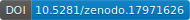

<h1 align="center">ℕ𝕒𝕥𝕙𝕒𝕟𝕚𝕖𝕝 ℂ𝕠𝕦𝕝𝕥𝕖𝕣</h1>

<!-- Social icons section -->

  
  &#8287;&#8287;&#8287;&#8287;&#8287;
  
  &#8287;&#8287;&#8287;&#8287;&#8287;
  

  
  
  

  

---

## 𝖳𝗈𝗉 𝖱𝖾𝗉𝗈𝗌𝗂𝗍𝗈𝗋𝗂𝖾𝗌:

<table width="100%" cellpadding="0">
<tr>
<td bgcolor="#545454" width="25%" valign="middle">
<a href="https://github.com/Nathaniel-Coulter/Obscura-Canvas-Uniformity">
<big><strong>𝖮𝖻𝗌𝖼𝗎𝗋𝖺-𝖢𝖺𝗇𝗏𝖺𝗌-𝖴𝗇𝗂𝖿𝗈𝗋𝗆𝗂𝗍𝗒 🕵️</strong></big>
</a>
 
 

💡 𝖬𝖺𝗇𝗎𝖺𝗅𝗅𝗒 𝖢𝗈𝗇𝗍𝗋𝗈𝗅 𝗒𝗈𝗎𝗋 𝖡𝗋𝗈𝗐𝗌𝖾𝗋 𝖥𝗂𝗇𝗀𝖾𝗋𝗉𝗋𝗂𝗇𝗍! 𝖮𝖻𝗌𝖼𝗎𝗋𝖺: 𝖢𝖺𝗇𝗏𝖺𝗌 𝖴𝗇𝗂𝖿𝗈𝗋𝗆𝗂𝗍𝗒 𝗂𝗌 𝖺 𝖢𝗁𝗋𝗈𝗆𝖾 𝖤𝗑𝗍𝖾𝗇𝗌𝗂𝗈𝗇 𝖺𝗇𝖽 𝖻𝗋𝗈𝗐𝗌𝖾𝗋 𝖿𝗂𝗇𝗀𝖾𝗋𝗉𝗋𝗂𝗇𝗍 𝗁𝖺𝗋𝖽𝖾𝗇𝗂𝗇𝗀 𝗍𝗈𝗈𝗅 𝖿𝗈𝖼𝗎𝗌𝖾𝖽 𝗈𝗇 𝖽𝖾𝗍𝖾𝗋𝗆𝗂𝗇𝗂𝗌𝗍𝗂𝖼 𝖿𝗂𝗇𝗀𝖾𝗋𝗉𝗋𝗂𝗇𝗍 𝗌𝗉𝗈𝗈𝖿𝗂𝗇𝗀, 𝗇𝗈𝗍 𝗋𝖺𝗇𝖽𝗈𝗆𝗂𝗓𝖺𝗍𝗂𝗈𝗇.

</td>

<td bgcolor="#545454" width="25%" align="center" valign="middle">

 

<big><strong><!-- OBSCURA_STARS -->4<!-- /OBSCURA_STARS --></strong></big>
&nbsp;&nbsp;&nbsp;

<big><strong><!-- OBSCURA_FORKS -->3<!-- /OBSCURA_FORKS --></strong></big>
</td>

<td bgcolor="#545454" width="25%" align="center" valign="middle">

 

<big><strong><!-- NATEBOT_STARS -->29<!-- /NATEBOT_STARS --></strong></big>
&nbsp;&nbsp;&nbsp;

<big><strong><!-- NATEBOT_FORKS -->3<!-- /NATEBOT_FORKS --></strong></big>
</td>

<td bgcolor="#545454" width="25%" valign="middle">
<a href="https://github.com/Nathaniel-Coulter/NateBot">
<big><strong>𝖭𝖺𝗍𝖾𝖡𝗈𝗍 🤖</strong></big>
</a>
 
 

𝖱𝖾𝖺𝗅-𝗍𝗂𝗆𝖾 𝖼𝗁𝖾𝗌𝗌 𝖼𝗈𝗆𝗉𝗅𝖾𝗑𝗂𝗍𝗒 𝖺𝗇𝖽 𝗍𝖾𝗇𝗌𝗂𝗈𝗇 𝖺𝗇𝖺𝗅𝗒𝗓𝖾𝗋 𝗎𝗌𝗂𝗇𝗀 λ𝟣 𝗌𝗍𝗋𝖺𝗍𝖾𝗀𝗂𝖼 𝗍𝖾𝗇𝗌𝗂𝗈𝗇 𝗍𝗈 𝗆𝖺𝗄𝖾 𝗉𝗈𝗌𝗂𝗍𝗂𝗈𝗇𝖺𝗅 𝗌𝗍𝗋𝗎𝖼𝗍𝗎𝗋𝖾 𝗅𝖾𝗀𝗂𝖻𝗅𝖾 𝖽𝗎𝗋𝗂𝗇𝗀 𝗉𝗅𝖺𝗒. 🧩 𝖢𝗎𝗌𝗍𝗈𝗆 𝖯𝗎𝗓𝗓𝗅𝖾𝗌 𝖻𝖺𝗌𝖾𝖽 𝗈𝗇 𝗒𝗈𝗎𝗋 𝖯𝖦𝖭'𝗌 𝗎𝗌𝗂𝗇𝗀 𝖬𝖺𝖼𝗁𝗂𝗇𝖾 𝖫𝖾𝖺𝗋𝗇𝗂𝗇𝗀 ! (𝖭𝖤𝖶)

</td>
</tr>
</table>

## 𝖯𝗎𝖻𝗅𝗂𝖼𝖺𝗍𝗂𝗈𝗇𝗌 & 𝖱𝖾𝗌𝖾𝖺𝗋𝖼𝗁:

<table>
<tr>
<td align="center" valign="top" width="50%">

 
<strong>
ItôFormer: 
Augmenting Stochastic Validity in Financial-Centric Deep Neural Networks
</strong>
 

</td>
<td align="center" valign="top" width="50%">

 
<strong>
Tokenization and Transformer Architectures: 
Controlled Ablation in Financial Time Series
</strong>
 

</td>
</tr>
<tr>
<td align="center" valign="top" width="50%">

 
<strong>
Neural Portfolio Allocators: 
Attention-Based Transformers and Multi-Agents
</strong>
 

</td>
<td align="center" valign="top" width="50%">

 
<strong>
Modeling Nonlinear Pharmacokinetics: 
Clinical v. Anecdotal Data
</strong>
 

</td>
</tr>
<tr>
<td align="center" valign="top" width="50%">

 
<strong>
Quantamental Portfolio Allocators: 
Deriving Alpha from Fundamental Metrics with Machine Learning
</strong>
 

</td>
<td align="center" valign="top" width="50%">
</td>
</tr>
</table>

## 🛠️ Languages & Tools

<h3 align="center">Programming Languages</h3>

  &nbsp;&nbsp;
  &nbsp;&nbsp;
  

<h3 align="center">Backend</h3>

  

<h3 align="center">Database</h3>

  &nbsp;&nbsp;
  &nbsp;&nbsp;
  

<h3 align="center">Tools</h3>

  &nbsp;&nbsp;
  

  

