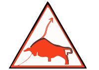
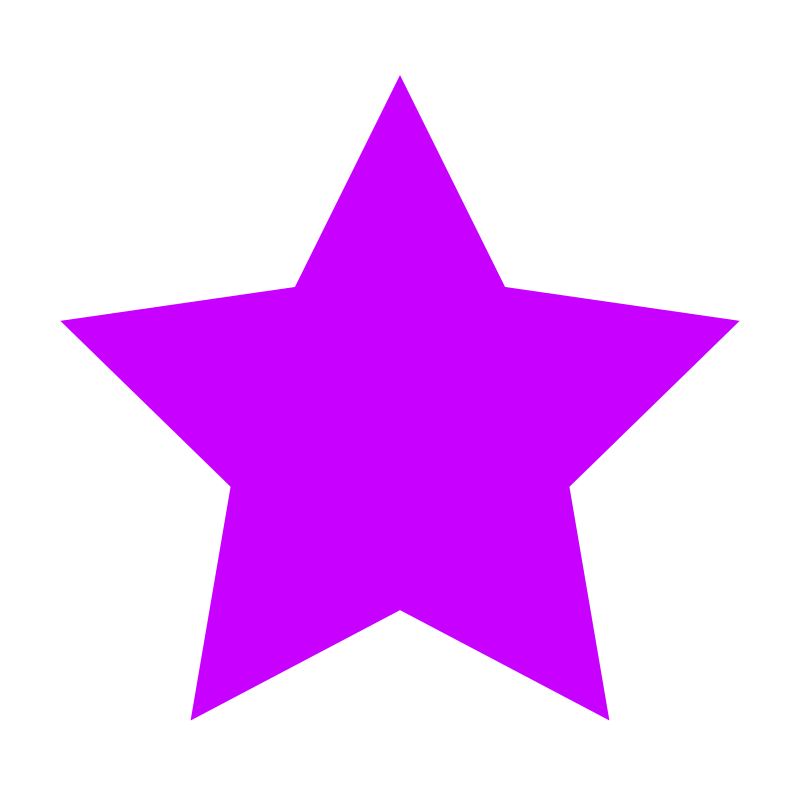
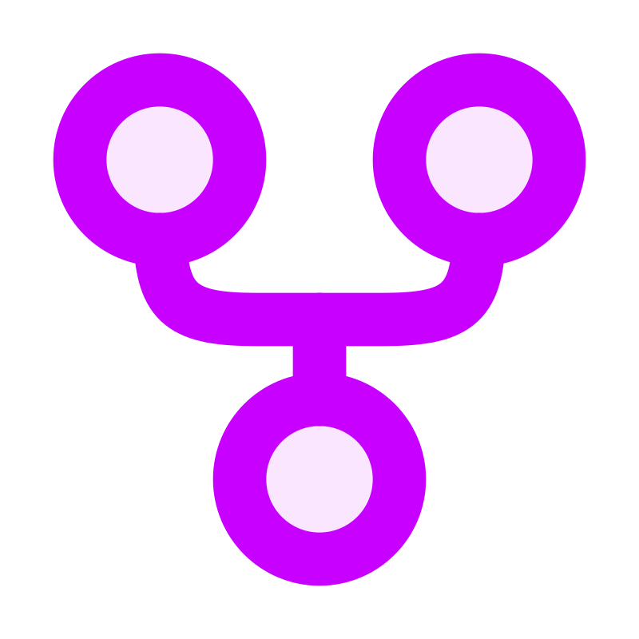
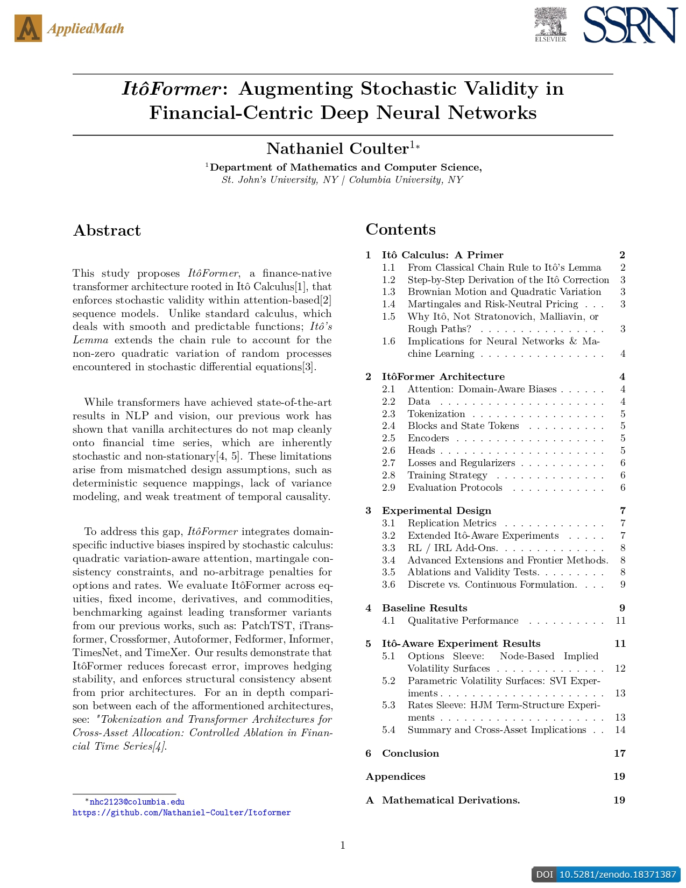
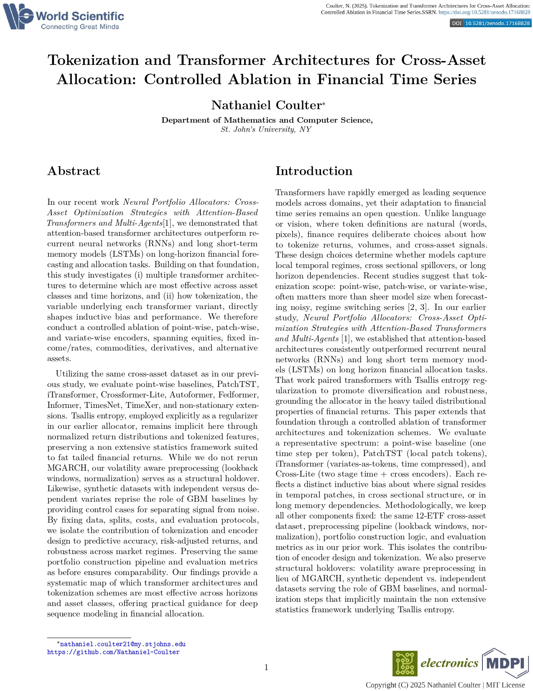
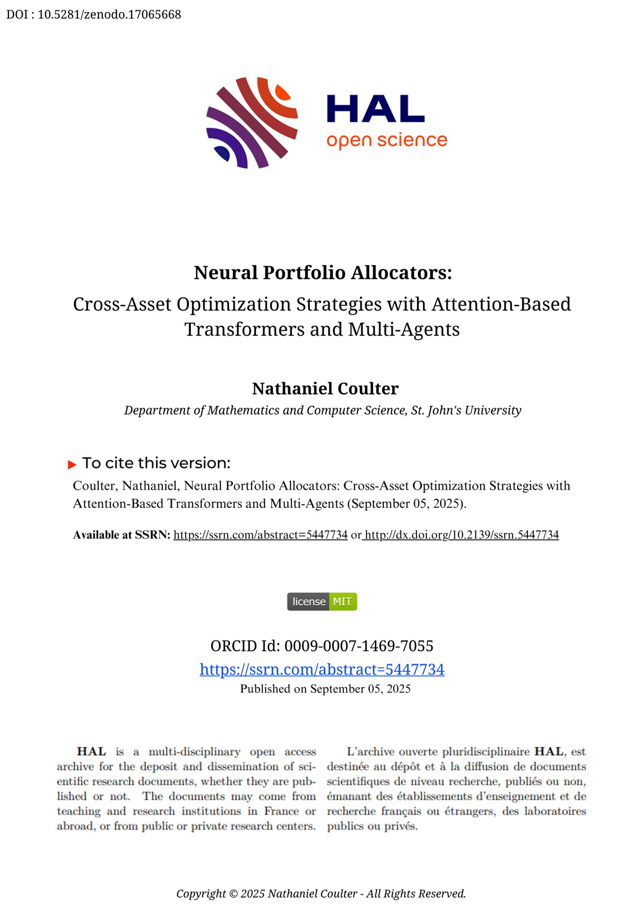
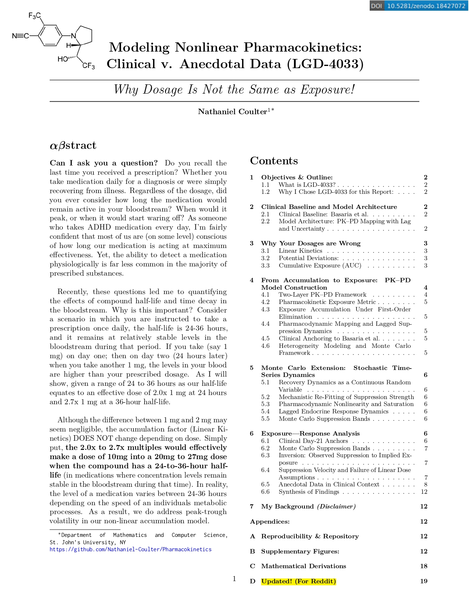
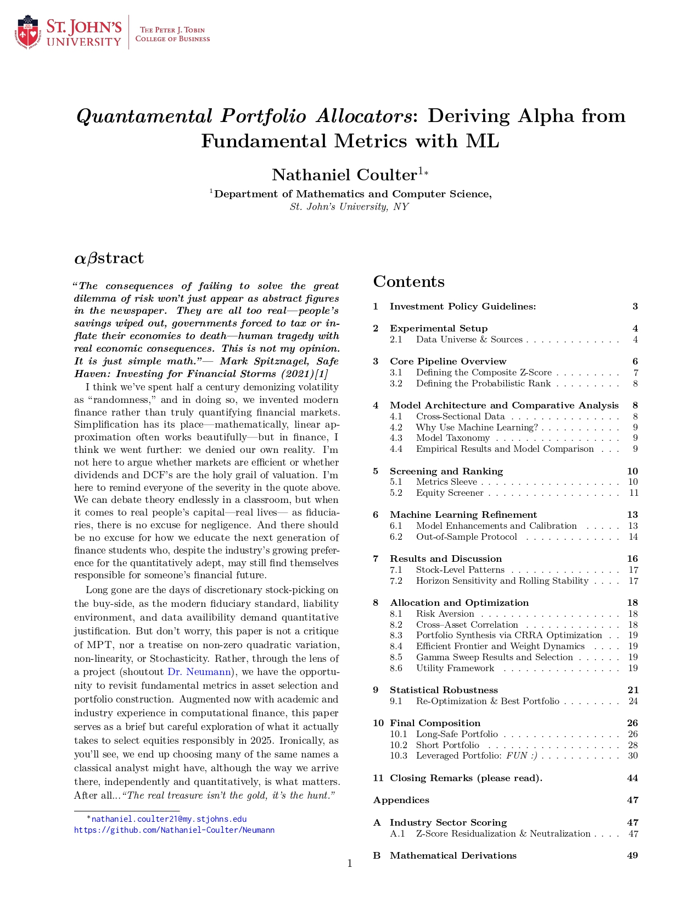

<h1 align="center">ɴᴀᴛʜᴀɴɪᴇʟ ᴄᴏᴜʟᴛᴇʀ</h1>

<!-- Social icons section -->

  
  &#8287;&#8287;&#8287;&#8287;&#8287;
  
  &#8287;&#8287;&#8287;&#8287;&#8287;
  

  
  
  

  

---

## Top Repositories:

<table width="100%" cellpadding="0">
<tr>
<td bgcolor="#545454" width="25%" valign="middle">
<a href="https://github.com/Nathaniel-Coulter/Obscura-Canvas-Uniformity">
<big><strong>Obscura-Canvas-Uniformity</strong></big>
</a>
 
 

💡 Manually Control your Browser Fingerprint! Obscura: Canvas Uniformity is a Chrome Extension and browser fingerprint hardening tool focused on deterministic fingerprint spoofing, not randomization.

</td>

<td bgcolor="#545454" width="25%" align="center" valign="middle">

 

<big><strong><!-- OBSCURA_STARS -->4<!-- /OBSCURA_STARS --></strong></big>
&nbsp;&nbsp;&nbsp;

<big><strong><!-- OBSCURA_FORKS -->3<!-- /OBSCURA_FORKS --></strong></big>
</td>

<td bgcolor="#545454" width="25%" align="center" valign="middle">

 

<big><strong><!-- NATEBOT_STARS -->29<!-- /NATEBOT_STARS --></strong></big>
&nbsp;&nbsp;&nbsp;

<big><strong><!-- NATEBOT_FORKS -->3<!-- /NATEBOT_FORKS --></strong></big>
</td>

<td bgcolor="#545454" width="25%" valign="middle">
<a href="https://github.com/Nathaniel-Coulter/NateBot">
<big><strong>NateBot 🤖</strong></big>
</a>
 
 

Real-time chess complexity and tension analyzer using λ₁ strategic tension to make positional structure legible during play. 🧩 Custom Puzzles based on your PGN's using Machine Learning ! (NEW)

</td>
</tr>
</table>

## Publications & Research:

<table>
<tr>
<td align="center" valign="top" width="50%">

 
<strong>
ItôFormer: 
Augmenting Stochastic Validity in Financial-Centric Deep Neural Networks
</strong>
 

</td>
<td align="center" valign="top" width="50%">

 
<strong>
Tokenization and Transformer Architectures: 
Controlled Ablation in Financial Time Series
</strong>
 

</td>
</tr>
<tr>
<td align="center" valign="top" width="50%">

 
<strong>
Neural Portfolio Allocators: 
Attention-Based Transformers and Multi-Agents
</strong>
 

</td>
<td align="center" valign="top" width="50%">

 
<strong>
Modeling Nonlinear Pharmacokinetics: 
Clinical v. Anecdotal Data
</strong>
 

</td>
</tr>
<tr>
<td align="center" valign="top" width="50%">

 
<strong>
Quantamental Portfolio Allocators: 
Deriving Alpha from Fundamental Metrics with Machine Learning
</strong>
 

</td>
<td align="center" valign="top" width="50%">
</td>
</tr>
</table>
